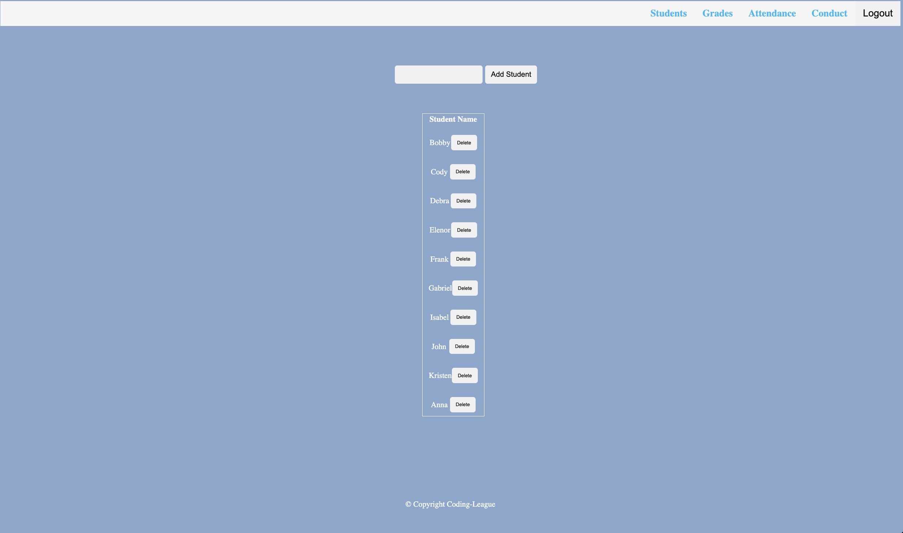
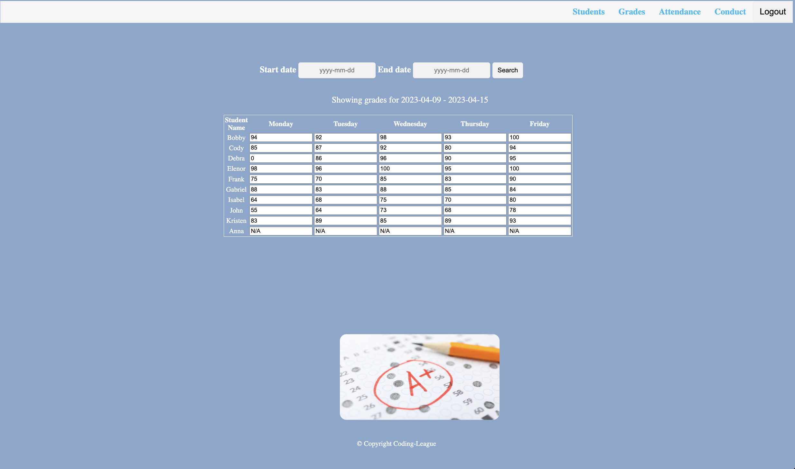
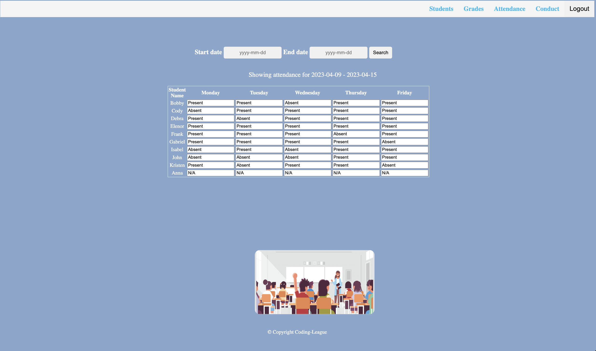

# Teacher-Sync
A full-stack application that allows teachers to log in to track their students' grades, attendance, and conduct for a school week.

## Description

This page utilizes Express.js, Sequalize, and Bootstrap to display a gradebook in which you can select a school week and document the grades, conduct, and attendance for a class of students. You can also add and delete students from a class. The teachers must login/register to be able to see their class of students.

## Usage

You can use this application if you would like to track grades, attendance, or conduct for a class of students.

## Link to Deployed Application

https://to do

## Screenshot of Deployed Application

